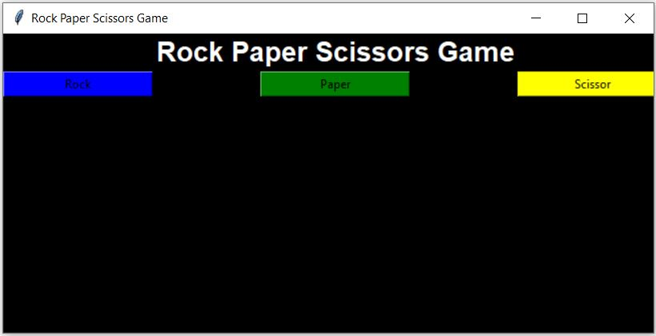
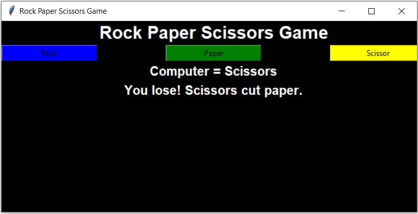
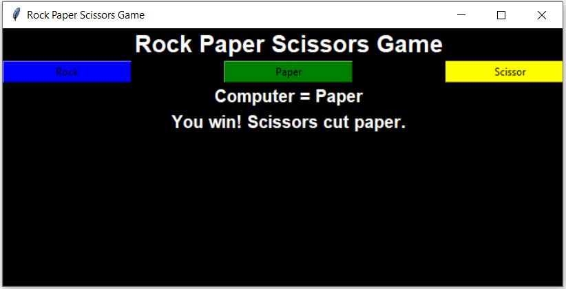
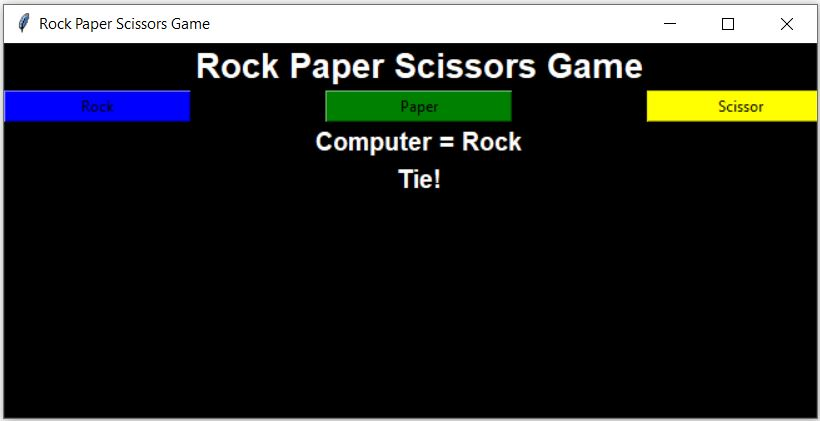

# Python-Rock-Paper-Scissors-Game
Rock Paper Scissor game in python using Tkinter

This is my Rock Paper Scissor game where the user can click any of the three buttons : Rock, Paper and Scissor to see if it wins, loses or it;s a tir with the computer.

# Initial game UI

# Player Wins

# Player Loses

# Tie between player and computer

